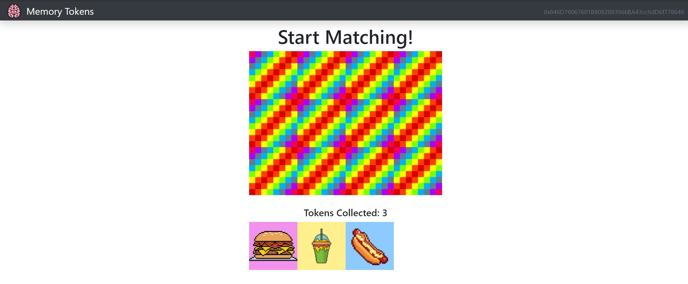
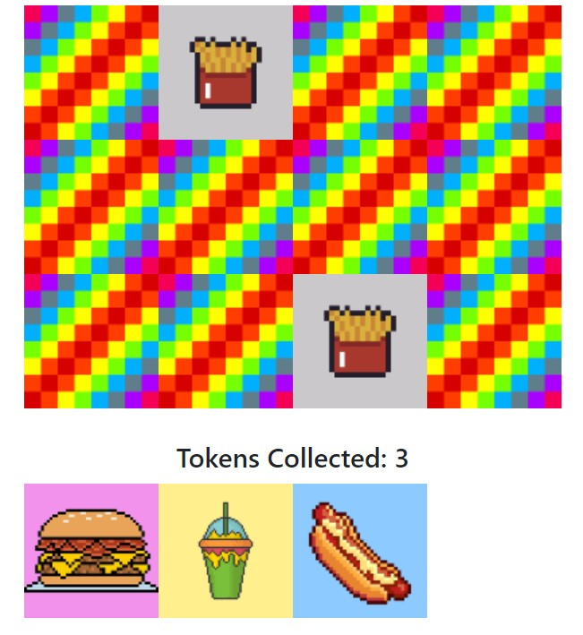
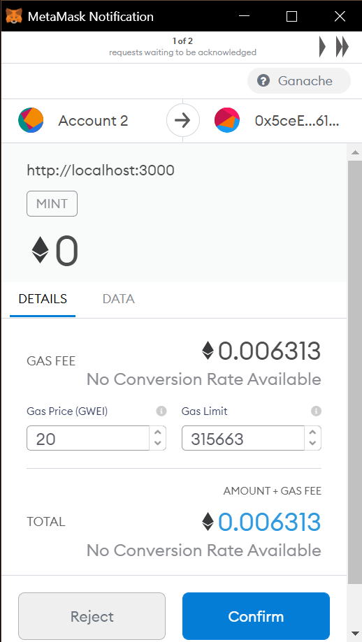

# blockchain-memory-game

A simple memory game with collectible NFT rewards. Created with Dapp University's [tutorial](https://www.youtube.com/watch?v=x-6ruqmNS3o&list=LL).

## Screenshots

  
Overall game, featuring a memory grid and a row of collected NFTs below.

  
An example of a match.

  
The NFT award being sent to MetaMask account.

## Usage

### Requirements

- Node
- [Truffle](https://www.npmjs.com/package/truffle) (with [Ganache](https://www.trufflesuite.com/ganache))
- [MetaMask](https://chrome.google.com/webstore/detail/metamask/nkbihfbeogaeaoehlefnkodbefgpgknn)

### Running App

1. Use the quick starts for MetaMask and Ganache.
2. Link MetaMask account with Ganache server.
3. Install: `npm i`
4. Start: `npm start`
